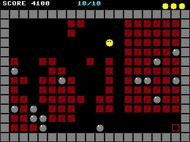
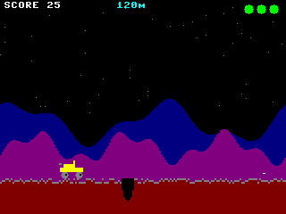
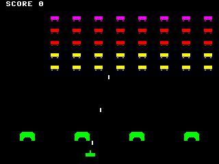
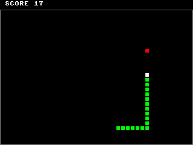

# fb4

A fast 4-bit indexed framebuffer driver for MicroPython on the ESP32 Cheap Yellow Display (CYD) with ST7789 TFT.

## Features

- **GS4_HMSB framebuffer** -- 4 bits per pixel, 16-color indexed palette
- **asm_xtensa SPI-FIFO show()** -- streams palette-converted RGB565 directly into the SPI hardware FIFO for ~30 ms full-screen updates
- **Standard MicroPython framebuf API** -- use `fill`, `text`, `line`, `rect`, `blit`, etc. as normal, then call `show()` to push to the LCD
- Portrait or landscape via `madctl` parameter

## Hardware

Designed for the **ESP32-2432S028R** (Cheap Yellow Display):

| Pin | GPIO | Function |
|-----|------|----------|
| SCK | 14 | SPI clock |
| MOSI | 13 | SPI data |
| DC | 2 | Data/Command |
| CS | 15 | Chip Select |
| RST | 4 | Reset |
| BL | 21 | Backlight |

## Quick Start

Copy `fb4.py` to your MicroPython device, then:

```python
import fb4

d = fb4.FB4()
d.fill(0)
d.text("HELLO CYD", 80, 110, 9)  # 9 = white
d.show()
```

### Palette

```python
d.set_palette(1, 255, 0, 0)   # index 1 = red
d.set_palette(9, 255, 255, 255)  # index 9 = white
```

### Portrait mode

```python
d = fb4.FB4(width=240, height=320, madctl=0x00)
```

## Examples

Game demos in `examples/`:

| Game | Screenshot |
|------|------------|
| `fb4_pillman.py` |  |
| `fb4_rock_runner.py` |  |
| `fb4_crater_crawler.py` |  |
| `fb4_space_intruders.py` |  |
| `fb4_serpent.py` |  |
| `fb4_gp.py` |  |
| `fb4_kessler.py` |  |

## How It Works

The driver allocates a `width * height / 2` byte buffer in GS4_HMSB format. When `show()` is called, a precomputed 256-entry lookup table (one byte pair to two RGB565 pixels) is used by an inline assembly loop that reads 64 bytes at a time and writes them directly to the SPI1 FIFO registers, bypassing the Python interpreter entirely.

## License

MIT
